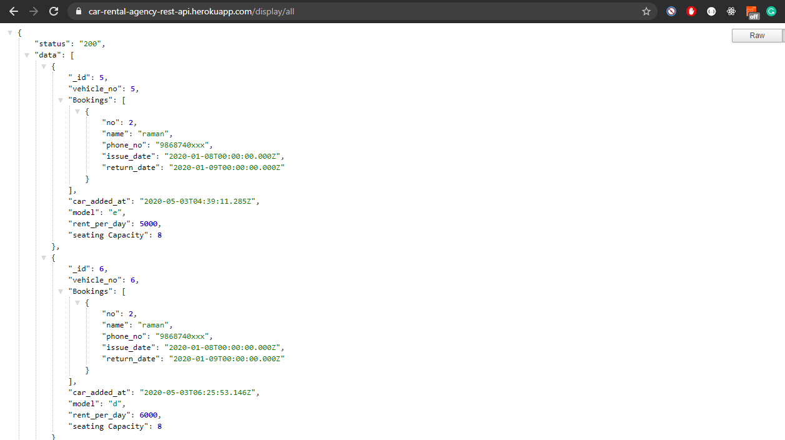
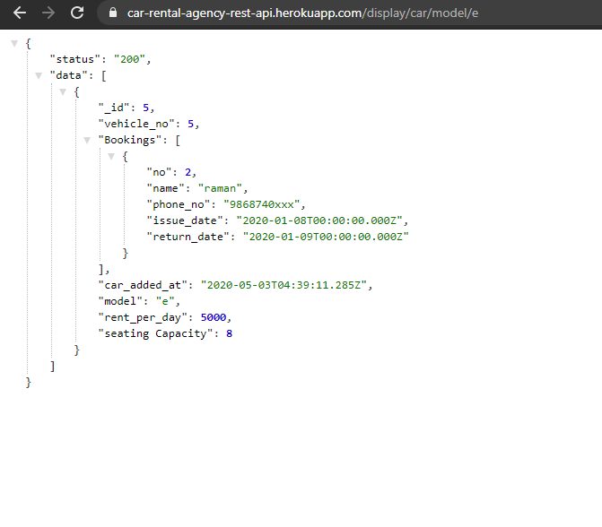
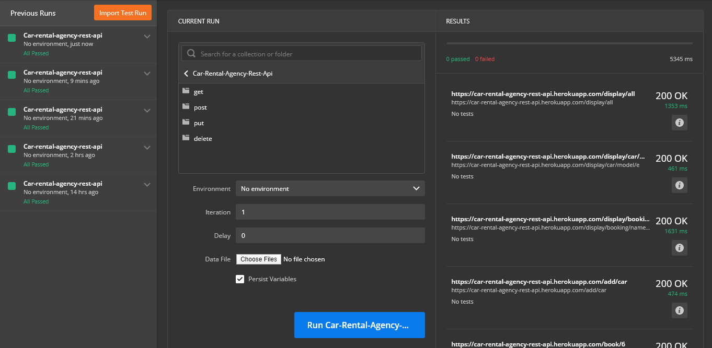

## Car-Rental-Agency-Rest-Api

### Rest-Api for CURD operations over Car objs.

#### Technologies Used  :- 

* Nodejs with Express Microfamework ,
* NoSQL Database : Mongo DB ,
* POSTMAN Collection ,
* Cloud Platforms : Heruku &  Mongo Atlas.

#### Task Covered :- 

* REST API ,
* POSTMAN Collection (https://www.getpostman.com/collections/dba800f78278c71b6bec) ,
* Hosted on Cloud Platforms : Heruku (https://car-rental-agency-rest-api.herokuapp.com/)


<hr />      

<details><summary>Installation Steps :</summary><br>

### REST-API :

1. Initialize a Node Application with ***package.js***

```bash
npm init --yes
```

2. Install Express

```bash
npm i express 
```
4. Create a server file

```node
//index.js
const express =  require('express');
const app = express();

app.get('/', (req ,res) => {

    res.send('hello world')
});

app.listen(3000, () =>  console.log('listening on port 3000'));
```

3. To start the node application

```bash
node index.js
```

4. To ease the development process install nodemon(node-monitor)
Nodemon is a utility that will monitor for any changes in your source and automatically restart your server.

```bash
npm i -g nodemon
```

5. To start the node application w/ Nodemon

```bash
nodemon index.js
#or
#export PORT=5000 && nodemon index.js
```
5. To start the node application 

```bash
npm run
```

<hr />

### Mongo-db :

1. install Body-parser // helps to parse json b/w clients and servers

```bash
npm install body-parser
```

2. Install Mongo-db :

```bash
npm install mongodb
```

3. Install path module :

```bash
npm install path
```

</details>
<details><summary>Various Api Paths :</summary><br>

### Various Api Paths :

#### Path 1.  :- Display all Car & there Bookings :
    [GET] (https://car-rental-agency-rest-api.herokuapp.com/display/all)
    or
    [GET] (http://localhost:3000/display/all)
o/p :
```json
{ 
    "status": "200",
    "data": [
        {
            "_id": 5,
            "vehicle_no": 5,
            "Bookings": [
                            {
                                "no": 2,
                                "name": "raman",
                                "phone_no": "9868740xxx",
                                "issue_date": "2020-01-08T00:00:00.000Z",
                                "return_date": "2020-01-09T00:00:00.000Z"
                            }
                        ],
            "car_added_at": "2020-05-03T04:39:11.285Z",
            "model": "e",
            "rent_per_day": 5000,
            "seating Capacity": 8
        } 
    ]
}
```

#### Path 2.  :- Search for all Cars & there Bookings b/ any {car/property/value}  or {booking/property/value} :

    [GET] (https://car-rental-agency-rest-api.herokuapp.com/display/car/model/e)
    or
    [GET] (http://localhost:3000/display/car/model/e)
o/p :
```json
    {
    "status": "200",
    "data": [
        {
            "_id": 5,
            "vehicle_no": 5,
            "Bookings": [],
            "car_added_at": "2020-05-03T04:39:11.285Z",
            "model": "e",
            "rent_per_day": 5000,
            "seating Capacity": 8
        }
    ]
}
```
#### Path 3.  :- Add new Cars :

    [POST] (https://car-rental-agency-rest-api.herokuapp.com/display/car/model/e)
    or
    [POST] (http://localhost:3000/display/car/model/e)
REQ BODY :
```json
{ 
	"_id" : 5,
	"vehicle_no" :	5 ,
	"model" : "e" ,
	"seating Capacity": 8 ,
	"rent_per_day" : 5000 , 
	"Bookings" : []
}
```
o/p :
```json
    {
    "status": "200",
    "data": [
        {
            "_id": 5,
            "vehicle_no": 5,
            "Bookings": [],
            "car_added_at": "2020-05-03T04:39:11.285Z",
            "model": "e",
            "rent_per_day": 5000,
            "seating Capacity": 8
        }
    ]
}
```
#### Path 4.  :- Book a Car :
    [PUT] (http://localhost:3000/book/4)
    or 
    [PUT] (https://car-rental-agency-rest-api.herokuapp.com/book/6)
REQ BODY :
```json
{
	"no": 2,
	"name": "raman",
	"phone_no": "9868740xxx",
	"issue_date": "Jan 8, 2020Z",
	"return_date": "Jan 9, 2020Z"
}
```

#### Path 5. Update a Car

    [PUT] (https://car-rental-agency-rest-api.herokuapp.com/update/car/1)
    or
    [PUT] (http://localhost:3000/update/car/1)
REQ BODY :
```json
{ 
	"seating Capacity": 10 ,
	"rent_per_day" : 2000  
}
```

#### Path 6. Delete a Car if NO BOOKING

    [DELETE] (https://car-rental-agency-rest-api.herokuapp.com/delete/car/5)
    or
    [DELETE] (http://localhost:3000/delete/car/5)

</details>




